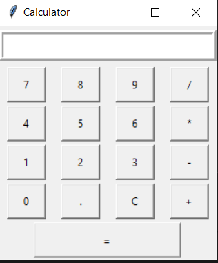
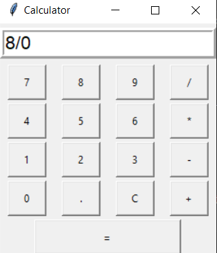
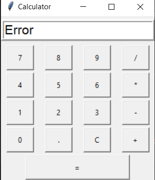
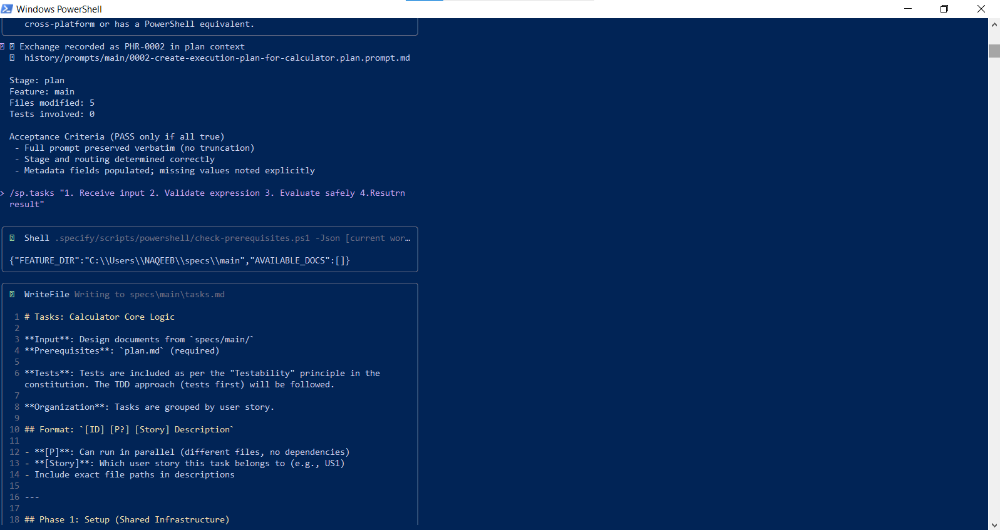

# 🌐 AI-Driven Development – 30-Day Challenge-Task-8

# Project Procedure Overview

This document outlines the major steps and procedures followed during the development of the Calculator project.

## **1. Project Initialization and Constitution**

This phase established the foundational principles and guidelines for the project.

*   **Command Used**: `/sp.constitution`
*   **Procedure**: The project constitution (`.specify/memory/constitution.md`) was created, defining the project's name, mission, core principles (Simplicity and Focus, Correctness and Precision, Usability, Testability, Minimal Dependencies), and governance procedures. This document serves as a non-negotiable guide for all subsequent development.
*   **Outcome**: A comprehensive `constitution.md` file was generated, and the `plan-template.md` was updated to reflect the new constitutional principles.

## **2. Feature Planning and Design**

This phase involved detailed planning and design of the calculator's core logic.

*   **Command Used**: `/sp.plan`
*   **Procedure**:
    *   A `plan.md` file was generated in `specs/main/`, outlining the technical context, architecture, and project structure.
    *   Research was conducted (`research.md`) to clarify technical decisions, such as the choice of Python 3.11, minimal dependencies, `pytest` for testing, and cross-platform CLI/Library as the target.
    *   A simple `data-model.md` was created to describe the input expression and output result.
    *   A functional `contract.yaml` was defined, detailing the `evaluate_expression` function's inputs, outputs, and error handling.
    *   A `quickstart.md` guide was provided for initial usage.
*   **Outcome**: A complete set of planning and design artifacts were created in `specs/main/`.

## **3. Task Generation**

This phase broke down the planned feature into actionable, dependency-ordered tasks.

*   **Command Used**: `/sp.tasks`
*   **Procedure**: A `tasks.md` file was generated in `specs/main/`, detailing the steps for implementing the calculator's core logic. Tasks were organized into phases (Setup, User Story 1, Polish & Cross-Cutting Concerns) and followed a Test-Driven Development (TDD) approach, with tests preceding implementation.
*   **Outcome**: A detailed `tasks.md` checklist was created, ready for execution.

## **4. Implementation (Test-Driven Development)**

This phase involved the actual coding of the calculator feature, strictly following the generated tasks and a TDD approach.

*   **Command Used**: `/sp.implement`
*   **Procedure**:
    *   **Phase 1 (Setup)**: Project directories (`src/calculator`, `tests`) and empty files (`__init__.py`, `core.py`, `main.py`, `test_core.py`, `conftest.py`) were created.
    *   **Phase 3 (User Story 1 - Core Calculation)**:
        *   Tests for simple addition, subtraction, multiplication, division, order of operations, whitespace handling, invalid characters, division by zero, and malformed expressions were written in `tests/test_core.py`.
        *   The `evaluate_expression` function in `src/calculator/core.py` was iteratively implemented and refined to pass all tests, correctly handling operator precedence and error conditions.
        *   A command-line interface was implemented in `src/main.py`.
    *   **Phase N (Polish & Cross-Cutting Concerns)**: Docstrings and comments were added to `src/calculator/core.py`, and a `README.md` file was created at the project root.
*   **Outcome**: A fully functional command-line calculator, with comprehensive tests and documentation, was implemented.

## **5. Project Execution and UI Integration**

This phase involved verifying the implemented functionality and starting the integration of a Graphical User Interface (GUI).

*   **Procedure**:
    *   The command-line calculator was successfully run and verified.
    *   A basic Tkinter-based UI (`src/ui.py`) was created, laying the groundwork for a graphical calculator.
*   **Outcome**: The core CLI functionality is verified, and the development of a user-friendly GUI has commenced.

