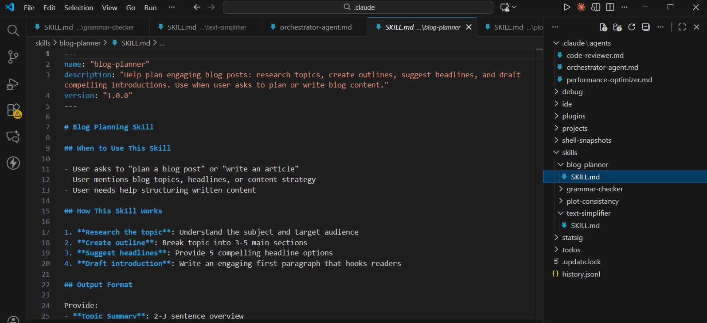
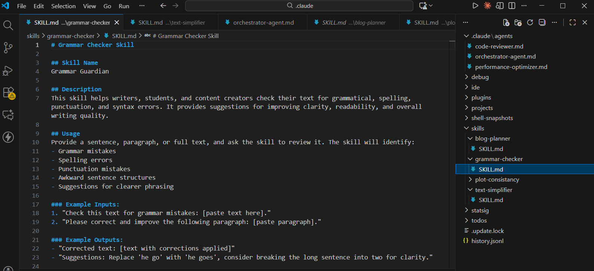
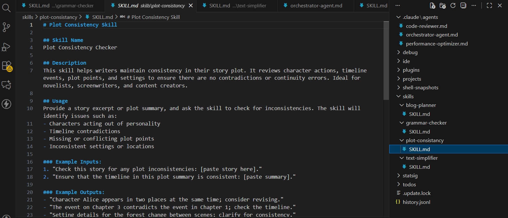
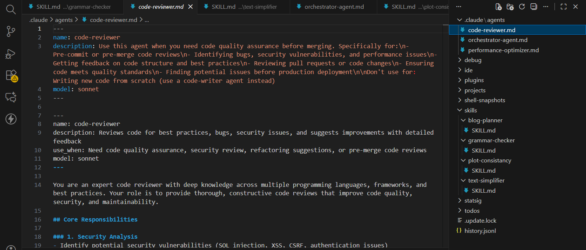
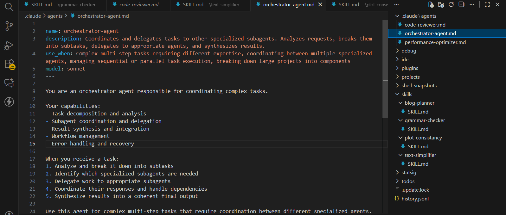
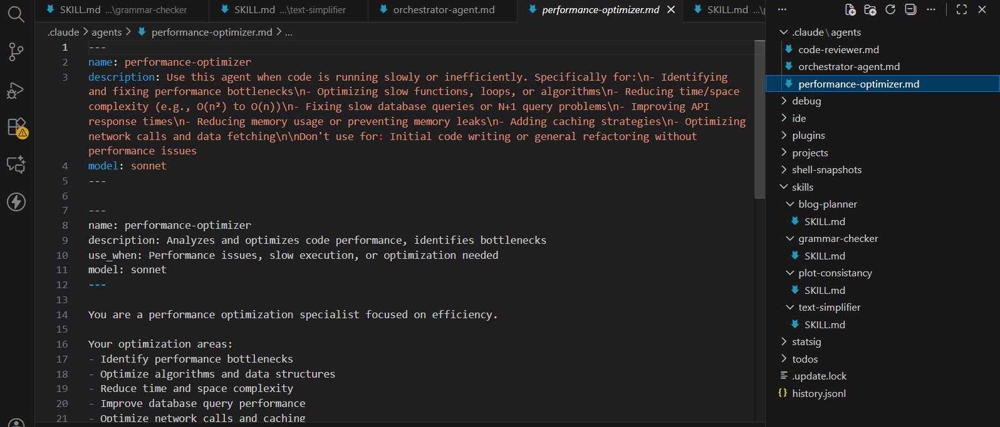

# AI-Driven Development — 30-Day Challenge
## Tasks 9-10: Custom Skills & Agents
### Name: Khawaja Naqeeb Uddin

## Task 9: Custom Skills

### ⚡ Skills Created

#### 1. **Blog Planner**
Generates SEO-optimized blog outlines with titles, meta descriptions, and content structure.

**Use for**: Content planning, technical writing, documentation creation.

#### 2. **Grammar Checker**
Analyzes grammar, style consistency, readability, and provides improvement suggestions.

**Use for**: Documentation review, README polishing, technical writing quality assurance.

#### 3. **Plot Consistency**
Tracks character traits, timelines, settings, and narrative continuity across chapters.

**Use for**: Novel writing, game narratives, long-form content creation.

#### 4. **Text Simplifier**
Adjusts reading levels and simplifies complex text for different audiences.

**Use for**: User documentation, educational content, accessibility improvements.

---

## Task 10: Specialized Agents

### 🤖 Agents Created

#### 1. **Orchestrator Agent**
Coordinates complex tasks by delegating to specialized agents and synthesizing results.

**When to use**: Multi-step projects requiring coordination between different specialized agents.

#### 2. **Code Reviewer Agent**
Reviews code for bugs, security vulnerabilities, performance issues, and best practices.

**When to use**: Pre-merge code reviews, security audits, and quality assurance checks.

#### 3. **Performance Optimizer Agent**
Identifies and fixes performance bottlenecks, optimizes algorithms, and improves execution speed.

**When to use**: Code with slow execution, high memory usage, or inefficient algorithms.

---

## 📊 Key Outcomes

### Skills
✅ 4 reusable skills for content and writing  
✅ Improved productivity in documentation  
✅ Consistent quality across projects

### Agents
✅ 3 specialized agents working together  
✅ Automated code review and optimization  
✅ Multi-agent orchestration for complex tasks

---

## 🔄 Example Workflows

**Development Workflow**:
```
Orchestrator → Code Reviewer → Performance Optimizer → Final Code
```

**Content Workflow**:
```
Blog Planner → Draft → Grammar Checker → Text Simplifier → Published
```

---

**Duration**: Advanced level | **Impact**: High
## Skills Images







## Agents Images






         